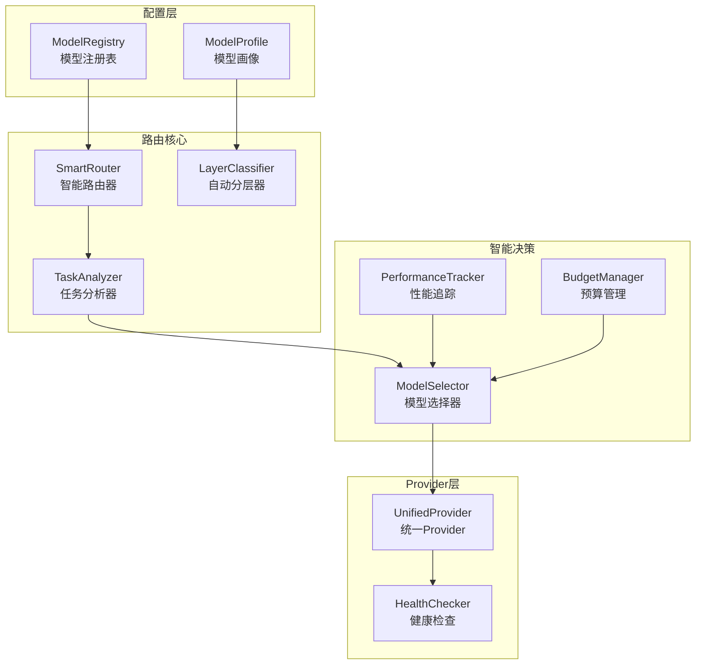

## 产品概述

重构MoneyClaw的LLM路由系统，从固定的三层架构升级为灵活的智能路由系统。用户可通过环境变量配置任意模型，系统根据成本、能力、速度、任务特性等多维度智能选择最优模型，并支持历史表现学习和预算感知降级。

## 核心功能需求

1. **灵活模型配置**：通过环境变量动态配置任意数量和类型的模型，不限于固定三层
2. **智能自动分层**：系统根据模型特性（成本、能力评分、延迟）自动计算并划分层级
3. **多维度路由决策**：综合考虑任务类型、金额、复杂度、预算、历史表现选择模型
4. **任务类型感知**：识别分析类、执行类、创意类任务，匹配最适合的模型
5. **历史学习优化**：记录每个模型的成功率、质量评分、实际成本，持续优化路由决策
6. **预算感知降级**：预算紧张时自动降级到更便宜的模型，确保服务连续性

## 技术栈

- **基础框架**: Python 3.12 + Pydantic + Pydantic-Settings
- **LLM调用**: LiteLLM (已集成)
- **数据持久化**: DuckDB (已集成) 用于存储模型历史表现
- **配置管理**: 环境变量 + Pydantic Settings
- **日志**: structlog (已集成)

## 实现方案

### 核心架构设计



### 关键设计决策

1. **动态层级系统**：从固定4层改为动态N层，系统根据模型成本和能力自动计算层级分数
2. **模型画像系统**：每个模型维护一个`ModelProfile`，包含成本系数、能力评分、延迟基准、任务专长
3. **任务分类器**：扩展`TaskRequest`支持`task_type`字段（ANALYTICS/EXECUTION/CREATIVE）
4. **性能反馈闭环**：每次调用后记录响应质量，用于调整模型权重
5. **预算感知路由**：当今日成本超过预算阈值时，自动应用更保守的路由策略

### 数据模型

**ModelProfile** - 模型画像

- model_id: 唯一标识
- provider_type: ollama/litellm
- cost_per_1k_tokens: 成本系数
- capability_score: 能力评分(0-1)
- avg_latency_ms: 平均延迟
- task_strengths: 任务类型专长
- availability_score: 可用性评分

**ModelPerformance** - 历史表现

- model_id
- timestamp
- task_type
- success: 是否成功
- quality_score: 质量评分
- actual_cost: 实际成本
- latency_ms: 实际延迟

### 路由算法

```
score(model, task) = 
    w1 * capability_match(model, task) +
    w2 * (1 - normalized_cost(model)) +
    w3 * (1 - normalized_latency(model)) +
    w4 * historical_success_rate(model, task) +
    w5 * availability_score(model)

budget_factor = (1 - today_cost / daily_budget)^2  # 预算紧张时降低

final_score = score * budget_factor
```

### 目录结构

```
moneyclaw/llm/
├── __init__.py                    # [MODIFY] 导出新的类和类型
├── types.py                       # [MODIFY] 扩展TaskRequest，新增ModelTier等
├── router.py                      # [MODIFY] 重构为SmartRouter
├── cache.py                       # [KEEP] 无需修改
├── cost_tracker.py                # [MODIFY] 扩展支持按模型追踪
├── model_registry.py              # [NEW] 模型注册表，管理所有配置模型
├── model_profile.py               # [NEW] 模型画像定义
├── performance_tracker.py         # [NEW] 历史性能追踪
├── budget_manager.py              # [NEW] 预算感知管理
├── task_analyzer.py               # [NEW] 任务类型分析器
├── layer_classifier.py            # [NEW] 自动分层计算器
├── providers/
│   ├── __init__.py                # [MODIFY] 导出统一Provider
│   ├── base.py                    # [KEEP] 基础接口不变
│   ├── unified_provider.py        # [NEW] 统一包装层
│   ├── litellm_provider.py        # [MODIFY] 适配新接口
│   └── ollama.py                  # [MODIFY] 适配新接口
└── storage/
    └── performance_store.py       # [NEW] DuckDB持久化

moneyclaw/config/
├── settings.py                    # [MODIFY] 扩展LLMSettings支持动态模型
└── defaults.py                    # [KEEP] 保留默认系统prompt

moneyclaw/cli.py                   # [MODIFY] 更新初始化逻辑

tests/test_llm/
├── test_smart_router.py           # [NEW] 新路由测试
├── test_model_registry.py         # [NEW] 注册表测试
└── test_performance_tracker.py    # [NEW] 性能追踪测试
```

### 环境变量配置方案

```
# 模型配置格式: LLM_MODEL_<ID>_<属性>
LLM_MODEL_1_PROVIDER=ollama
LLM_MODEL_1_MODEL=qwen2.5:7b
LLM_MODEL_1_COST_PER_1K=0
LLM_MODEL_1_CAPABILITY=0.6
LLM_MODEL_1_TASKS=execution,creative

LLM_MODEL_2_PROVIDER=litellm
LLM_MODEL_2_MODEL=deepseek/deepseek-chat
LLM_MODEL_2_API_KEY=${DEEPSEEK_API_KEY}
LLM_MODEL_2_COST_PER_1K=0.0005
LLM_MODEL_2_CAPABILITY=0.8
LLM_MODEL_2_TASKS=analytics,execution

# 路由配置
LLM_ROUTER_STRATEGY=balanced  # cost_optimized/quality_optimized/balanced
LLM_AUTO_LAYER=true           # 是否自动分层
LLM_LEARN_ENABLED=true        # 是否启用历史学习
```

## 实施注意事项

1. **向后兼容**: 保留原有的`LLMLayer`枚举和`select_layer`方法作为兼容层
2. **性能考虑**: 模型选择计算在毫秒级，使用预计算的评分缓存
3. **健康检查**: 定期检测模型可用性，自动排除故障模型
4. **降级安全**: 预算紧张时优先保证任务完成，而非强制使用最便宜的模型
5. **数据持久化**: 性能数据使用DuckDB按日分区存储，避免数据膨胀