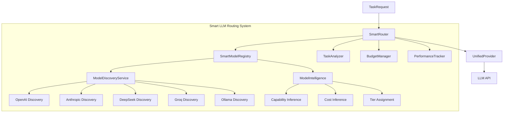

## 用户需求

用户希望重构现有的四层LLM路由机制，核心需求如下：

1. **零配置模型发现**：用户只需提供API key，系统自动识别所有可用模型，无需手动配置模型列表
2. **智能模型识别**：系统根据模型名称/ID自动推断其能力等级和成本等级
3. **自动模型注册**：发现可用模型后自动注册到路由系统
4. **智能分层和路由**：保留原有的智能路由逻辑（基于money_involved、complexity等），但基于动态发现的模型进行路由决策

## 产品概述

MoneyClaw是一个7x24运行的AI Agent，通过智能路由系统自动选择最优LLM处理不同任务，平衡成本与效果。新版本将实现真正的"即插即用"体验——用户只需填入API key，系统自动发现可用模型并智能路由。

## 核心功能

- **自动模型发现**：支持OpenAI、Anthropic、DeepSeek、Groq、Ollama等主流Provider的自动模型查询
- **智能能力推断**：通过模型名称模式匹配（如gpt-4o、claude-3-opus等）自动推断模型能力等级
- **动态层级分配**：根据推断的能力/成本自动将模型分配到合适层级
- **智能任务路由**：基于任务复杂度、资金风险、预算状态动态选择最优模型
- **预算感知降级**：预算紧张时自动切换到成本最低的可用模型

## 技术栈

- **Python 3.12+**：项目基础语言
- **Pydantic**：配置验证和数据模型
- **LiteLLM**：统一LLM调用接口
- **Ollama**：本地模型支持
- **DuckDB**：性能数据持久化
- **httpx**：异步HTTP客户端用于模型发现
- **structlog**：结构化日志记录

## 实现方案

### 架构设计



### 模块说明

1. **ModelDiscoveryService**：负责查询各Provider的可用模型列表

- 支持OpenAI (/v1/models)、Anthropic (固定列表)、DeepSeek (/models)、Groq (/openai/v1/models)、Ollama (/api/tags)
- 异步并行查询所有配置了API key的Provider
- 返回标准化的模型元数据列表

2. **ModelIntelligence**：根据模型名称推断能力和成本

- **Capability Inference**：通过正则匹配模型名称推断能力等级 (0-1)
    - gpt-4o, claude-3-opus, gemini-1.5-pro → 0.95 (高能力)
    - gpt-4o-mini, claude-3-haiku → 0.75 (中等能力)
    - deepseek-chat, llama-3.x → 0.70 (中等能力)
    - qwen, phi, mistral → 0.60 (基础能力)
- **Cost Inference**：通过模型名称推断相对成本等级
- **Tier Assignment**：综合能力和成本自动分配层级

3. **SmartModelRegistry**：管理所有发现的模型

- 存储ModelProfile（模型画像：名称、Provider、能力、成本、层级、可用性）
- 提供按层级、能力、成本筛选模型的接口
- 自动剔除不可用的模型

4. **SmartRouter**：智能路由核心

- 基于原有路由逻辑，但使用动态发现的模型
- 整合TaskAnalyzer、BudgetManager、PerformanceTracker
- 选择最优模型并执行调用

5. **UnifiedProvider**：统一的Provider包装

- 封装LiteLLM和Ollama Provider
- 标准化接口，支持所有发现的模型

### 性能考虑

- **异步并行发现**：所有Provider的模型查询并行执行，避免串行延迟
- **缓存机制**：模型列表缓存15分钟，避免频繁API调用
- **懒加载**：首次请求时才触发模型发现
- **超时控制**：每个Provider查询设置5秒超时，避免阻塞

### 数据流

1. 系统启动/首次请求 → 触发ModelDiscoveryService并行查询所有Provider
2. ModelIntelligence推断每个发现模型的能力和成本
3. SmartModelRegistry注册所有模型并分配层级
4. 收到TaskRequest → TaskAnalyzer分析任务类型
5. BudgetManager检查预算状态
6. SmartRouter根据任务需求、预算、模型可用性选择最优模型
7. UnifiedProvider执行实际调用
8. PerformanceTracker记录调用结果用于优化

## 目录结构

```
moneyclaw/
├── llm/
│   ├── __init__.py                    # [MODIFY] 更新导出
│   ├── types.py                       # [MODIFY] 扩展TaskRequest，新增ModelProfile
│   ├── cache.py                       # [EXISTING] 响应缓存
│   ├── cost_tracker.py                # [EXISTING] 成本追踪
│   ├── router.py                      # [MODIFY] 重构为SmartRouter
│   ├── model_registry.py              # [NEW] SmartModelRegistry
│   ├── model_discovery.py             # [NEW] ModelDiscoveryService
│   ├── model_intelligence.py          # [NEW] ModelIntelligence
│   ├── task_analyzer.py               # [NEW] TaskAnalyzer
│   ├── budget_manager.py              # [NEW] BudgetManager
│   ├── performance_tracker.py         # [NEW] PerformanceTracker
│   └── providers/
│       ├── __init__.py                # [MODIFY] 更新导出
│       ├── base.py                    # [MODIFY] 扩展LLMProvider接口
│       ├── litellm_provider.py        # [MODIFY] 适配新接口
│       ├── ollama_provider.py         # [MODIFY] 适配新接口
│       └── unified_provider.py        # [NEW] 统一Provider包装
├── config/
│   ├── __init__.py                    # [EXISTING]
│   ├── settings.py                    # [MODIFY] 简化LLM配置
│   └── defaults.py                    # [EXISTING]
├── data/
│   └── performance_store.py           # [NEW] DuckDB性能数据存储
└── cli.py                             # [MODIFY] 更新初始化逻辑
```

## 关键代码结构

### ModelProfile

```python
@dataclass
class ModelProfile:
    """模型画像，包含能力、成本、可用性等元数据"""
    model_id: str           # 唯一标识，如 "openai/gpt-4o"
    provider: str           # Provider名称
    display_name: str       # 友好显示名称
    capability_score: float # 能力评分 0-1
    cost_tier: CostTier     # 成本等级
    llm_layer: LLMLayer     # 分配的层级
    context_length: int     # 上下文长度
    is_available: bool      # 是否可用
    metadata: dict          # 额外元数据
```

### SmartRouter核心接口

```python
class SmartRouter:
    async def discover_models(self) -> list[ModelProfile]:
        """发现并注册所有可用模型"""
        
    async def route(self, request: TaskRequest) -> LLMResponse:
        """智能路由到最优模型"""
        
    def get_model_for_task(self, task_type: TaskType, budget_status: BudgetStatus) -> ModelProfile:
        """根据任务类型和预算状态选择最优模型"""
```