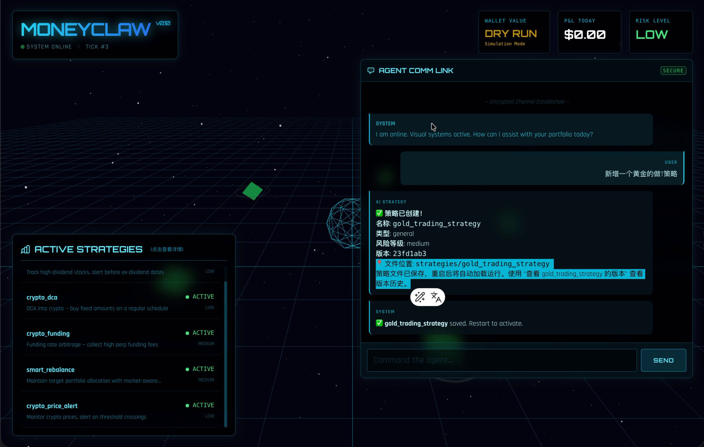

# MoneyClaw

7x24 AI Agent that saves and makes money autonomously.

Inspired by [OpenClaw](https://github.com/openclaw/openclaw) — an open-source multi-channel AI assistant. MoneyClaw takes the autonomous agent concept in a different direction: instead of being a general-purpose chat assistant, it focuses entirely on **financial optimization** — scanning for opportunities, executing strategies, and minimizing its own operating costs.

## Architecture

```
┌─────────────────────────────────────────────────────────┐
│                     MoneyClaw Agent                     │
│                                                         │
│  ┌──────────┐  ┌──────────┐  ┌───────────┐             │
│  │ Planner  │  │Evaluator │  │  Memory   │             │
│  └────┬─────┘  └────┬─────┘  └─────┬─────┘             │
│       └──────┬───────┘              │                   │
│         ┌────▼────┐          ┌──────▼─────┐             │
│         │  Brain  │◄────────►│   SQLite   │             │
│         └────┬────┘          └────────────┘             │
│              │                                          │
│  ┌───────────▼──────────────────────────────┐           │
│  │         Strategy Plugin System           │           │
│  │  ┌─────┐ ┌─────┐ ┌─────┐ ┌─────┐       │           │
│  │  │ DCA │ │Alert│ │Fund │ │Rebal│ + ... │           │
│  │  └──┬──┘ └──┬──┘ └──┬──┘ └──┬──┘       │           │
│  └─────┼───────┼───────┼───────┼───────────┘           │
│        └───────┴───┬───┴───────┘                        │
│              ┌─────▼──────┐                             │
│              │  Executor  │  dry_run=True (default)     │
│              │  (ccxt)    │                              │
│              └────────────┘                             │
│                                                         │
│  ┌──────────────────────────────────────────┐           │
│  │        4-Layer LLM Router                │           │
│  │  L0 Rules ─▶ L1 Ollama ─▶ L2 DeepSeek  │           │
│  │                          ─▶ L3 Claude   │           │
│  └──────────────────────────────────────────┘           │
│                                                         │
│  ┌──────────────┐  ┌───────────────┐                    │
│  │  Telegram    │  │ Web Dashboard │                    │
│  │  Bot + Notify│  │ (HTMX)       │                    │
│  └──────────────┘  └───────────────┘                    │
└─────────────────────────────────────────────────────────┘
```

## Preview



*Web dashboard showing active strategies and AI chat interface for strategy management*

### LLM Four-Layer Cost Architecture

The agent treats its own LLM calls as a cost to minimize.

| Layer | Tech | Cost | Use Cases |
|-------|------|------|-----------|
| L0 | Rules engine | $0 | Price alerts, thresholds, cron jobs, simple math |
| L1 | Ollama (local) | ~$0/day | News summaries, sentiment, filtering |
| L2 | DeepSeek / Groq | <$0.50/day | Complex analysis, strategy optimization |
| L3 | Claude / GPT-4 | On-demand | Critical decisions, risk assessment |

Target: **< $20/month** total LLM cost.

### Built-in Strategies

| Strategy | Layer | Risk | Description |
|----------|-------|------|-------------|
| `crypto_price_alert` | L0 | low | Monitor crypto prices, alert on threshold crossings |
| `crypto_dca` | L0 | low | DCA into crypto — buy fixed amounts on schedule |
| `crypto_funding` | L1 | medium | Funding rate arbitrage — collect high perp funding fees |
| `stock_dividend` | L1 | low | Track high-dividend stocks, alert before ex-dividend |
| `smart_rebalance` | L2 | medium | Maintain target portfolio allocation with market-aware rebalancing |

Each strategy has a `config.yaml` in its directory for customization.

### Safety Mechanisms

- **Dry run by default** — no real trades unless explicitly enabled
- Single trade limit: $50 (configurable)
- Daily loss cap: $100
- Per-strategy daily loss cap: $30
- Human approval gate via Telegram for amounts > threshold
- Cooldown after consecutive losses
- Complete audit trail in SQLite

## Development Setup

### Prerequisites

- Python 3.12+
- [Ollama](https://ollama.ai/) (optional, for Layer 1 local LLM)

### Install

```bash
git clone https://github.com/MindDock/moneyclaw-py.git
cd moneyclaw-py

# Create virtual environment
python -m venv .venv
source .venv/bin/activate  # Linux/macOS
# .venv\Scripts\activate   # Windows

# Install with dev dependencies
pip install -e ".[dev]"
```

### Configure

```bash
cp .env.example .env
# Edit .env — at minimum set TELEGRAM_TOKEN and TELEGRAM_CHAT_ID
```

Key environment variables:

| Variable | Required | Description |
|----------|----------|-------------|
| `TELEGRAM_TOKEN` | Yes | Telegram bot token from @BotFather |
| `TELEGRAM_CHAT_ID` | Yes | Your Telegram chat ID |
| `DEEPSEEK_API_KEY` | No | DeepSeek API key (Layer 2) |
| `GROQ_API_KEY` | No | Groq API key (Layer 2 alternative) |
| `ANTHROPIC_API_KEY` | No | Anthropic API key (Layer 3) |
| `OPENAI_API_KEY` | No | OpenAI API key (Layer 3 alternative) |
| `BINANCE_API_KEY` | No | Binance exchange key (for live trading) |
| `BINANCE_SECRET` | No | Binance exchange secret |

### Run

```bash
# Start the agent (dry run mode, web dashboard + Telegram bot)
moneyclaw run

# Start without Telegram
moneyclaw run --no-telegram

# Start without web dashboard
moneyclaw run --no-web

# Other commands
moneyclaw status       # Show current status & P&L
moneyclaw strategies   # List discovered strategies
moneyclaw cost         # Show LLM cost summary
moneyclaw pause        # Pause agent (via web API)
moneyclaw resume       # Resume agent
moneyclaw version      # Show version
```

The web dashboard is available at `http://localhost:8080` by default.

### Testing

```bash
# Run all tests
pytest

# Run with coverage
pytest --cov=moneyclaw --cov-report=term-missing

# Run specific test module
pytest tests/test_strategies/test_crypto_dca.py

# Lint
ruff check .

# Format
ruff format .

# Type check
mypy moneyclaw --ignore-missing-imports
```

### Project Structure

```
moneyclaw-py/
├── moneyclaw/                  # Main package
│   ├── agent/                  # Brain, memory, evaluator, planner
│   ├── config/                 # Pydantic settings
│   ├── data/                   # Data feeds & DuckDB storage
│   │   └── feeds/              # CoinGecko, yfinance, RSS
│   ├── execution/              # Trade executor, risk manager, approvals
│   ├── interface/
│   │   ├── telegram/           # Bot commands & notifications
│   │   └── web/                # FastAPI + HTMX dashboard
│   ├── llm/                    # 4-layer router, cost tracker, cache
│   │   └── providers/          # Ollama, LiteLLM adapters
│   ├── plugins/                # Strategy base class, loader, registry
│   └── scheduler/              # APScheduler jobs & event bus
├── strategies/                 # Strategy plugins (auto-discovered)
│   ├── crypto_dca/             # DCA buying
│   ├── crypto_funding/         # Funding rate arbitrage
│   ├── crypto_price_alert/     # Price threshold alerts
│   ├── smart_rebalance/        # Portfolio rebalancing
│   └── stock_dividend/         # Dividend tracking
├── tests/                      # Test suite (158 tests)
├── docker/                     # Docker deployment
├── pyproject.toml              # Dependencies & tool config
└── .env.example                # Configuration template
```

## Docker Deployment

For production or VPS deployment:

```bash
# Copy and configure
cp .env.example .env
# Edit .env with your API keys

# Start with Docker Compose (includes Ollama)
docker compose -f docker/docker-compose.yml up -d

# View logs
docker compose -f docker/docker-compose.yml logs -f moneyclaw

# Stop
docker compose -f docker/docker-compose.yml down
```

The Docker setup includes:

- **moneyclaw** — the agent container (Python 3.12-slim)
- **ollama** — local LLM server for Layer 1 (free inference)

Data is persisted to `./data/` via volume mount. Strategies in `./strategies/` are also mounted, so you can add/edit strategies without rebuilding.

### GPU Support (Ollama)

To enable GPU acceleration for Ollama, uncomment the `deploy` section in `docker/docker-compose.yml`:

```yaml
deploy:
  resources:
    reservations:
      devices:
        - driver: nvidia
          count: all
          capabilities: [gpu]
```

## Telegram Commands

| Command | Description |
|---------|-------------|
| `/status` | Current state + today's P&L |
| `/report` | Detailed report (daily/weekly/monthly) |
| `/approve <id>` | Approve a pending operation |
| `/reject <id>` | Reject a pending operation |
| `/pause` | Pause all strategies |
| `/resume` | Resume operations |
| `/cost` | Agent's own running cost |
| `/strategies` | Strategy performance overview |
| `/ask <question>` | Ask the agent anything |

## Writing Strategies

Create a new directory in `strategies/` with an `__init__.py`:

```python
from moneyclaw.plugins.base import Strategy, Opportunity, Score, Result

class MyStrategy(Strategy):
    name = "my_strategy"
    description = "What this strategy does"
    risk_level = "low"       # low / medium / high
    min_llm_layer = 0        # 0=rules, 1=local, 2=cheap, 3=premium

    async def scan(self) -> list[Opportunity]:
        """Called every tick — scan for opportunities."""
        ...

    async def evaluate(self, opp: Opportunity) -> Score:
        """Evaluate whether an opportunity is worth acting on."""
        ...

    async def execute(self, opp: Opportunity) -> Result:
        """Execute the strategy and return results."""
        ...

    def estimate_roi(self) -> float:
        """Expected ROI multiplier (e.g., 1.05 = 5% return)."""
        return 1.05
```

Add a `config.yaml` in the same directory for user-configurable parameters:

```yaml
# strategies/my_strategy/config.yaml
my_param: 42
watchlist:
  - AAPL
  - MSFT
```

Load it in your strategy:

```python
from moneyclaw.plugins.base import load_strategy_config

class MyStrategy(Strategy):
    def __init__(self, watchlist=None):
        cfg = load_strategy_config(MyStrategy)
        self._watchlist = watchlist or cfg.get("watchlist", ["AAPL"])
```

The strategy will be auto-discovered when placed in the `strategies/` directory.

## License

MIT
